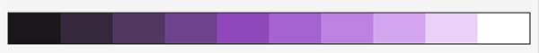
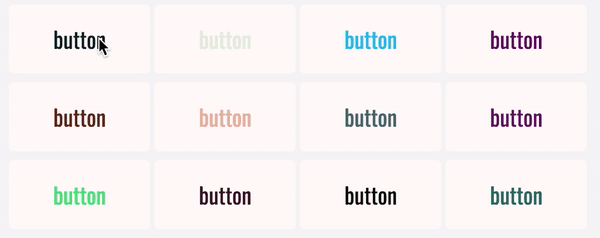

# Progresión de color
Genera un color aleatorio y utilízalo como tono principal para crear una progresión en 10 pasos incrementando la saturación y luminosidad del color hasta llegar al blanco puro



En este ejercicio aplicaremos:

- Bucles
- Interpolación
- Función `random()`

---

# Generar Helpers
A partir de una mapa y utilizando las directivas de sass crea un set de clases auxiliares para poder aplicar las propiedades `margin-*` y `padding-*` a etiquetas HTML

```SCSS
    // Mapa de configuración
    $offset: (
        0: 0,
        8: 0.5rem,
        16: 1rem,
        24: 1.5rem,
        32: 2rem,
        40: 2.5rem,
        48: 3rem
    );

    // ...

    // Añade un margen de 32px
    .m-32 { margin: 2rem; }

    // Añade un padding por abajo de 1rem
    .pb-16 { padding-bottom: 1rem; }
```

En este ejercicio haremos uso de:

- Mapas
- Bucles
- Condicionales
- Interpolación

---

# Aplicar Themes a botones
Crear 12 botones utilizando etiquetas `<a>` y `<button>` y que cumplan las siguientes características:

- Estiliza los botones con una clase básica + un modificador
- Crear un `%placeholder` para unificar estilos entre las etiquetas `<a>` y `<button>`
- Genera aleatoriamente un color principal para cada botón. Evita que el color se aproxime demasiado al blanco o al negro
- Utiliza un color fijo para aplicar como `background-color`
- Crear un `@mixin` que acepte dos parámetros para aplicar a `color` y `background-color` 
- Intercambia el color frontal y el de background
- Crea un estilo para los enlaces visitados
- Reduce el tamaño del botón cuando se hace click para hacer un efecto sutil de que el botón se pulsa



En este ejercicio haremos uso de:

- Nomenclatura BEM
- `%placeholder`
- `@mixin`
- Bucles
- Interpolaciones